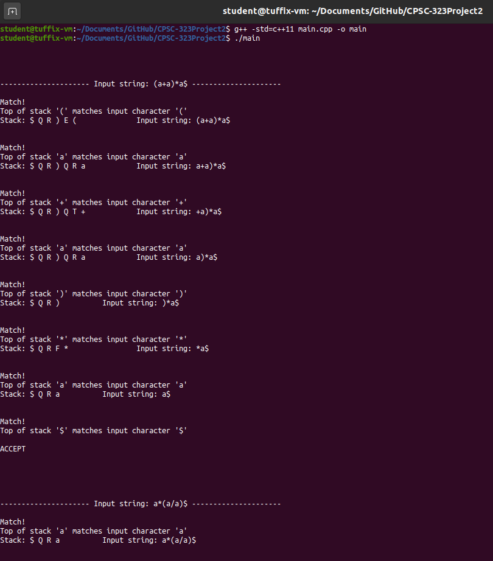

# CPSC-323Project2
#### Given the following CFG and the parsing table, write a program to trace input strings over the alphabet { i, +, - , *, / ), ( } and ending with $.
#### To run the program, compile main.cpp (eg g++ -std=c++11 main.cpp -o main) and run the file (eg ./main)

